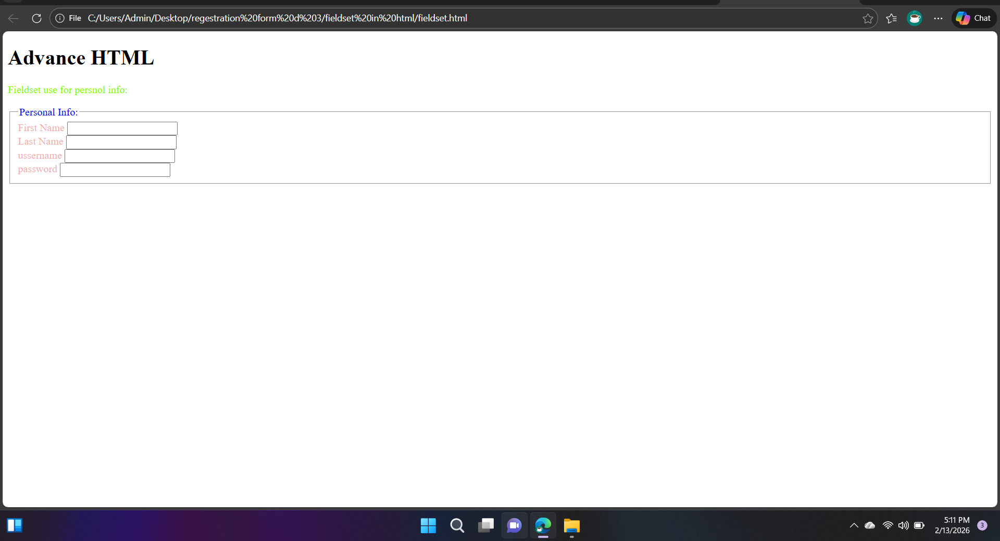

# HTML Fieldset Form

This project is a simple and well-structured HTML form built using `fieldset` and `legend` elements along with internal CSS. It serves as a frontend practice project to understand how form fields can be grouped and styled using basic HTML and CSS.

## 🔗 Live Demo
https://vinodkumarjaipal.github.io/html-form-fieldset-project/

## 📌 Project Overview
The HTML Fieldset Form project demonstrates the use of the `fieldset` and `legend` elements to group related form inputs. Grouping enhances readability, semantics, and user experience within forms.

This project focuses on clean HTML structure and internal CSS styling without external frameworks or JavaScript.

## ✨ Features
- Grouped form fields using `fieldset` and `legend`
- Clean and semantic HTML layout
- Internal CSS for form styling
- Beginner-friendly form design
- Simple and readable code

## 🧩 HTML Elements Used
- `<form>`
- `<fieldset>`
- `<legend>`
- `<label>`
- `<input>`
- `<button>`

## 🛠 Technologies Used
- HTML5
- CSS3

## 📸 Screenshot

## 🎯 Learning Outcomes
- Understanding form grouping techniques
- Using `fieldset` and `legend` for semantic structure
- Styling forms using internal CSS
- Strengthening fundamental frontend skills

## 👨‍💻 About the Developer
I am a Full Stack Software Engineering student with a strong foundation in HTML and CSS.  
This project was built as part of my web development learning journey to practice form structures and semantic HTML.

## 📄 License
This project is open-source and available for learning and educational purposes.
